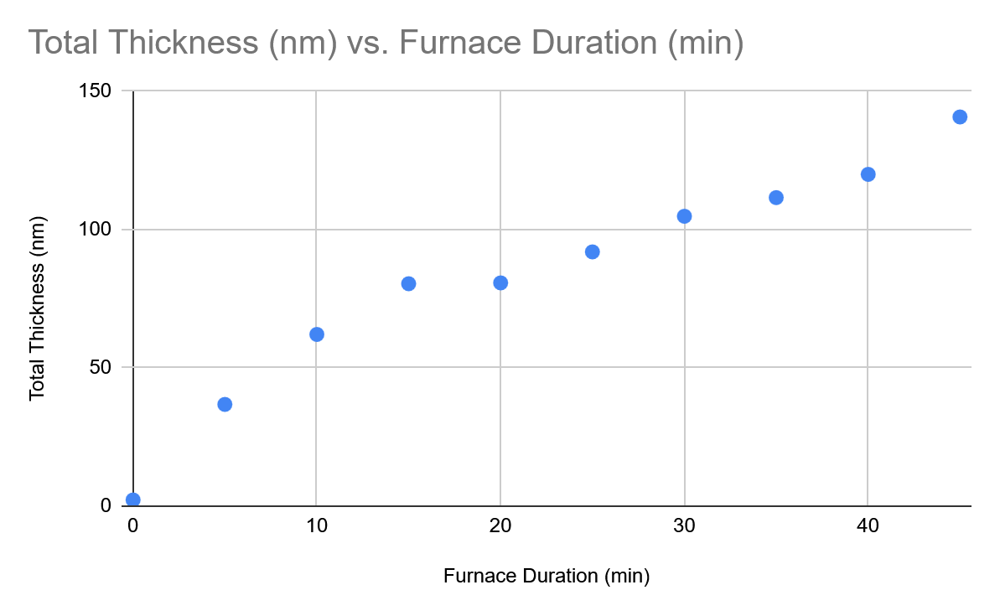

# 2026-07-07 furnace sputter ellipso profilo

### Objective

Measure the thickness of $$SiO_2$$ grown on a silicon sample (with native oxide) in our tube furnace at $$1100^{\circ}\text{C}$$

### Process

1. Wafer: Si, 4-inch, p-type, 100
2. Cleave wafer into 2cm x 1cm samples
3. Preheat tube furnace to $$1100^{\circ}\text{C}$$
4. Place sample inside for t minutes, t ranging from 5 to 45 in increments of 5
5. Measure thermal oxide thickness using Woollam Ellipsometer @ IITNF

### Plot

<figure><figcaption></figcaption></figure>

### Data


