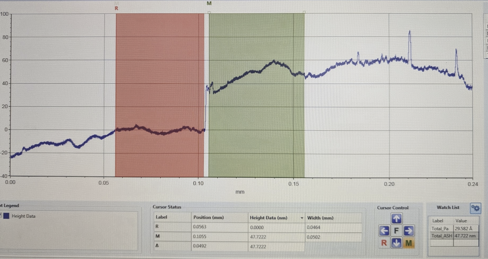

# 2026-07-07 sputter profilo

### Process

Aluminium sputter, power = 115W, duration = 5min, 15min, 30min

### Samples

#### Sample 1: 5min, 115W. 38-47nm

<figure><figcaption></figcaption></figure>

comments: very dirty - black spots on both Si and deposited Al

Reading 1:

Scan length: 240um\
**Step height: 47nm**\
**Profile:**

<figure><figcaption></figcaption></figure>

Reading 2:

Scan length: 80um\
**Step height: 38nm**

Profile:

<figure><figcaption></figcaption></figure>

#### Sample 2: 15min, 115W.&#x20;

Reading 1:

comments: sample was much cleaner visually

scan location:\
.png>)

scan length: 325um\
scan duration: 325s\
horizontal resolution according to software: 3nm/pt

<figure><figcaption></figcaption></figure>

step visible at 0.12mm, but no flat region on either side

after fitting two point linear:

### TODO&#x20;

