# tube-furnace

## The Tube Furnace

A tube furnace is a special piece of equipment widely used in many labarotaries to carry out various chemical reactions in a controlled manner. In the case of semiconductors, tube furnaces are used mainly for carrying out the oxidation of Silicon or any type of diffusion doping.

$$
\Large \mathrm{Si} + \mathrm{O_2} \xrightarrow{1100°\mathrm{C}} \mathrm{SiO_2}
$$

The tube furnace we have built at HackerFab IITB can currently perform oxidation, but can be modified to carry out any high temperature process. This is what it looks like!

<figure>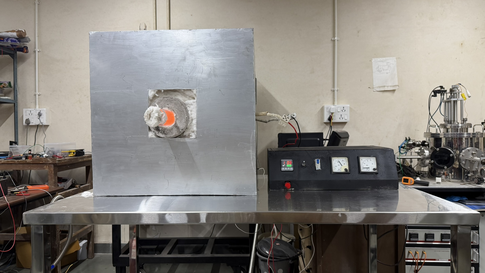<figcaption></figcaption></figure>

## Specs

Standard Operating Temperature : 1100±5°C

Heating Zones : Single Zone Configuration

Tube Dimensions : 60mm OD, 800mm Length

Tube Material : Quartz

Temperature Controller : Multispan UTC-4202G+

## Disclaimer

This documentation is provided for educational and informational purposes only. Building and operating a tube furnace involves extreme temperatures, high electrical currents, and hazardous materials. By following this guide, you acknowledge that you are doing so at your own risk. The authors and HackerFab IITB are not responsible for any property damage, injury, or loss of life that may occur as a result of attempting this project. Always consult a qualified professional if you are unsure about electrical wiring or high-temperature systems. An entire paragraph on safety is given below.

## Bill of Materials

Links to all the materials will be provided in another table separately.&#x20;

<table><thead><tr><th width="153.6640625">Material</th><th>Purpose</th><th>Quantity</th><th>Cost</th><th width="149">Net Cost (INR)</th></tr></thead><tbody><tr><td>Quartz Tube (67mm dia, 800mm)</td><td>Tube</td><td>1</td><td>Vendor will give a Quotation</td><td>2500</td></tr><tr><td>Kanthal A1 14 SWG</td><td>Heating Element</td><td>1 kg</td><td>Depends on vendor (INR 3-5k)</td><td>4703.39</td></tr><tr><td>Kanthal A1 20 SWG</td><td>A "brace" for the heating element</td><td>100 g</td><td>Depends on the vendor</td><td>300</td></tr><tr><td>Whytheat A</td><td>Refractory Cement</td><td>25 kg</td><td>INR 168/kg. The rate for Whytheat is pretty standard</td><td>4200</td></tr><tr><td>Inner PVC Pipe (75mm dia, 1m length) with the cap</td><td>To create the cement mold</td><td>1</td><td>Depends on vendor, but PVC pipes are in every hardware store and they are pretty cheap.</td><td>300</td></tr><tr><td>Outer PVC Pipe (160 mm dia, 1m length) with the cap</td><td>To create cement mold</td><td>1</td><td>Depends on vendor</td><td>500</td></tr><tr><td>Steel Rod of diameter 7mm and length 60 cm</td><td>Used to coil the kanthal</td><td>1</td><td>Depends on the steel shop. They will probably just cut a bigger rod</td><td>100</td></tr><tr><td>Ceramic Wool of density 96g/cc</td><td>Used as insulation around the refractory cement cast</td><td>10 kgs</td><td>110/kg, again the rate for ceramic wool is pretty standard.</td><td>1100</td></tr><tr><td>MS Sheets (3 by 4 feet)</td><td>Will be made into the enclosure</td><td>4 sheets (~30 kgs)</td><td>Go into the steel market and buy it yourself. The cheapest rate I found it at in Mumbai was 90/kg. There were some vendors trying to sell it to me at 200/kg as well.</td><td>2700</td></tr><tr><td>Steel angles (100cm)</td><td>To provide mechanical support and strengthen the steel enclosure</td><td>2</td><td>Again, depends on the vendor. They are pretty cheap and you should be able to get them under 200 rupees.</td><td>400</td></tr><tr><td>Screws</td><td>To make one face of the steel enclosure removable</td><td>20</td><td>1 rupee per screw</td><td>20</td></tr><tr><td>Temperature Controller (Multispan UTC-4202G+)</td><td>For PID Temperature control</td><td>1</td><td>Buy the temperature controller as per budget. Read the section on the temperature controller to get to know more</td><td>3300</td></tr><tr><td>Solid State Relay (SSR) 40 Amps</td><td>For electrical isolation, and helps the temperature controller do its job using PWM</td><td>1</td><td>As per MRP. This will be available in any electronics store</td><td>250</td></tr><tr><td>Aluminium Heat Sink</td><td>To help regulate the temperature of the SSR</td><td>1</td><td>As per MRP. This may take some time to find.</td><td>200</td></tr><tr><td>Thermal Paste</td><td>Goes between the heat sink and the SSR</td><td>1</td><td>As per MRP. You'll find this in any laptop repair shop</td><td>100</td></tr><tr><td>Bakelite Connector 30 Amps (6-Way open connection)</td><td>Connects Mains voltage, SSR and heating element. This is where all the electronic components meet.</td><td>1</td><td>As per MRP. This may take some time to find.</td><td>30</td></tr><tr><td>Mains Switch (Single Pole MCB, 25 Amps)</td><td>Turn this on to let power from your outlet into your circuit</td><td>1</td><td>As per MRP. You'll find this in your normal electronics store</td><td>300</td></tr><tr><td>Heating Switch (Single Pole MCB, 2 Amps Rocker type)</td><td>Turn this on to let power from your circuit into your heating element</td><td>1</td><td>As per MRP.</td><td>300</td></tr><tr><td>LED Light (Big one)</td><td>Indicates whether the tube furnace is on or off</td><td>2</td><td>As per MRP.</td><td>40</td></tr><tr><td>K type MI thermocouple (Mineral insulated)</td><td>To measure the temperature. The thermocouple should be of appropriate dimensions and should be mineral insulated</td><td>1</td><td>Vendor will give you a quotation</td><td>1950</td></tr><tr><td>Internal wiring (2.5 sqmm)</td><td>To connect the high current parts of the circuit</td><td>1m</td><td>35-50/meter</td><td>50</td></tr><tr><td>Internal wiring (1 sqmm)</td><td>Normal electrical wires to connect everything</td><td>2m</td><td>20-30/meter</td><td>60</td></tr><tr><td>Metal Box</td><td>To keep all the electrical components</td><td>1</td><td>You can find some scrap box or make this yourself</td><td>0</td></tr><tr><td>Quartz Boat with hook</td><td>To keep the silicon wafer</td><td>1</td><td>Vendor will give a quotation</td><td>100</td></tr><tr><td>Push-Pull Quartz rod (Length 1m)</td><td>To push and pull the quartz boat in and out of the tube furnace</td><td>1</td><td>Vendor will give a quotation</td><td>600</td></tr><tr><td>Standard Ammeter</td><td>To measure the current going in the coil</td><td>1</td><td>Buy the standard one you see in labs</td><td>500</td></tr><tr><td>Standard Voltmeter</td><td>To measure voltage across mains</td><td>1</td><td>Buy the standard on you see in labs</td><td>500</td></tr><tr><td>Porcelain connector (15 Amps)</td><td>For connecting the coil to standard wiring</td><td>2</td><td>20/piece</td><td>40</td></tr><tr><td>Ceramic beads</td><td>To safely insulate the exposed coil</td><td>1 kg</td><td>You will need much less than 1kg. We found some in our lab, so we didn't have to buy any.</td><td>150</td></tr><tr><td>Build Cost</td><td>Net build cost, if you don't mess anything up</td><td>-</td><td>-</td><td><strong>31,543.39</strong></td></tr><tr><td>Angle Grinder</td><td>To cut steel, kanthal, a very useful tool to have in general</td><td>1</td><td>You might get this below 2500</td><td>2500</td></tr><tr><td>Cutting Wheel</td><td>The angle grinder will be fitted with this, buy an extra incase the first one wears off</td><td>2</td><td>50/piece</td><td>100</td></tr><tr><td>Drill</td><td>Will be used for tapping the steel plate</td><td>1</td><td>Again, you might get this cheaper</td><td>3000</td></tr><tr><td>Thread Bit</td><td>For the drill</td><td>1</td><td>Again, you might get this cheaper</td><td>150</td></tr><tr><td>Aluminium Paint</td><td>So that the steel enclosure does not rust</td><td>1</td><td>350</td><td>350</td></tr><tr><td>Turpentine Oil</td><td>You will most likely need it to remove any paint off of your skin</td><td>1L</td><td>150</td><td>150</td></tr><tr><td>Multimeter</td><td>You should have this by now</td><td>1</td><td>200</td><td>200</td></tr><tr><td>Clampmeter</td><td>Not necessary, but useful</td><td>1</td><td>300</td><td>300</td></tr><tr><td>Fabrication Cost</td><td>To fabricate the coil and the steel enclosure you will need access to a lathe and a welding machine.</td><td>-</td><td>This cost is variable, and depends on how much your vendor charges you.</td><td>3447</td></tr><tr><td>Net Budget</td><td>-</td><td>-</td><td>-</td><td><strong>35,500</strong></td></tr></tbody></table>

## The Build

### The Furnace

This build covers the conversion of the Kanthal wire into a coil, creating the refractory cement cast, covering it with ceramic wool and fabricating the steel enclosure. Quite a bit of this is laborious work, so you might need a few keen helpers here and there, be ready to ask for help! After all of this, the furnace should look like this :

<figure><figcaption></figcaption></figure>

#### The Heating Element

First off, you need to buy approximately 1 kg of Kanthal A1 (14 Gauge). It should look a bit like this :

<figure><figcaption></figcaption></figure>

Some basic questions you might have:

* Why Kanthal A1?
* Why 14 Gauge Kanthal?
* How did we decide how much Kanthal to buy?

All these are genuine questions, and I will discuss them after I show you how to fabricate the coil.

#### 1. Fabricating The Coil

To fabricate the coil:

* Use a lathe operated by an experienced professional.
* Provide the operator with a 8 mm diameter steel rod (which serves as a mandrel).
* Wind the Kanthal A1 wire around the 8 mm mandrel.
* **ENSURE that you leave at least 1 meter of loose Kanthal wire on each end!**
* Maintain a 3.5 mm pitch between each turn.
* Measure the finished coil's resistance with a multimeter.
* Confirm that the coil is longer than 5 m.

After the coil has been machined, it should look like this (notice the loose wire at the ends) :&#x20;

<figure>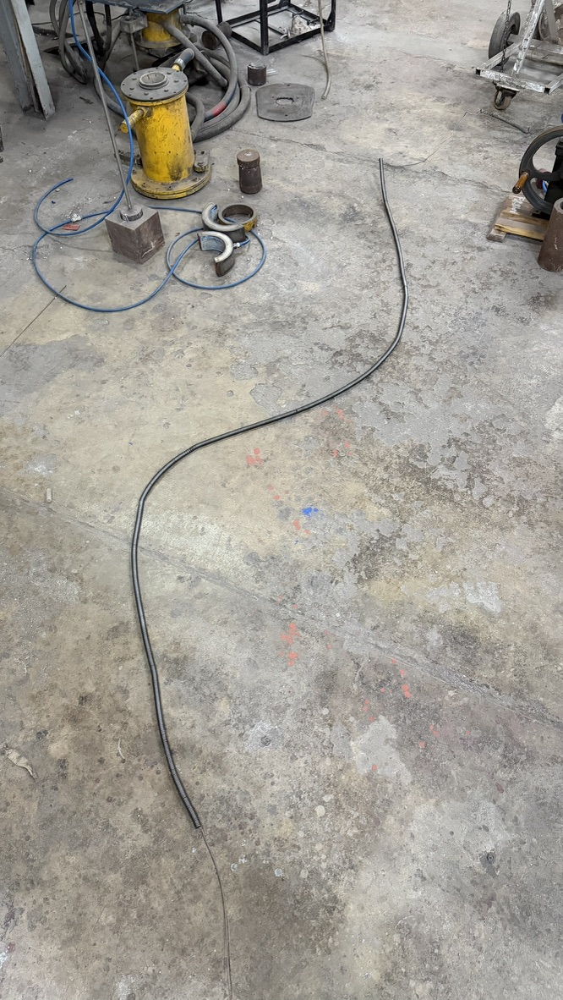<figcaption></figcaption></figure>

#### If you want to design the coil specifications by yourself

This is something totally optional, which you can do if you are adventurous in nature. For others, just skip this block and go to "2. Making The Cement Cast".

The first thing you need to keep in mind, that the net resistance of the coil

To the future Rushat : pls fill this after the furnace fabrication is done

#### 2. Making The Cement Cast

Before starting this, ensure you have the following things :

* Kanthal A1 Coil of minimum length 5m (if you are following our design)
  * Note : Do not worry if the coil is not 5 meters long, just read this section to get a feel for what we will be doing, and then read section 2.2.
* Inner and outer PVC pipes with their caps
* Whytheat A or K Refractory Cement (25 Kgs)
* A minimum of 4 people to help you

#### 2.1 The Coiled Coil

The precise shape of our heating element would be a coiled coil as shown below:

<figure><figcaption></figcaption></figure>

The image is a bit poor, but this is a model of the actual heating element inside the furnace.&#x20;

Here is a general workflow of what we will be doing next :

1. Coiling the coil around the inner PVC (2.1)
2. Using this to create a PVC mould (2.2)
3. Pouring in the cement, and letting it sit (2.3)
4. Curing the cement (2.4)

Firstly, when we pour the cement, none of it should go into the inner PVC, so you must install the caps onto it before coiling the coil onto it. Then make even markings at a distance of 3cm, leaving more than 10 cm of space on each side. Like this :

<figure>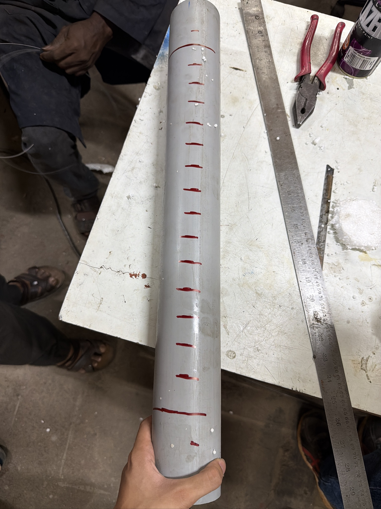<figcaption></figcaption></figure>

Now, the hard part. At one end - tie the Kanthal coil's loose end with a Kanthal wire of lesser gauge. Make maximum use of force and tie it as hard as humanly possible. Make sure you have more people to help you. Notice the place it which you tie it must be that place where the loose end starts and the coil ends :

<figure>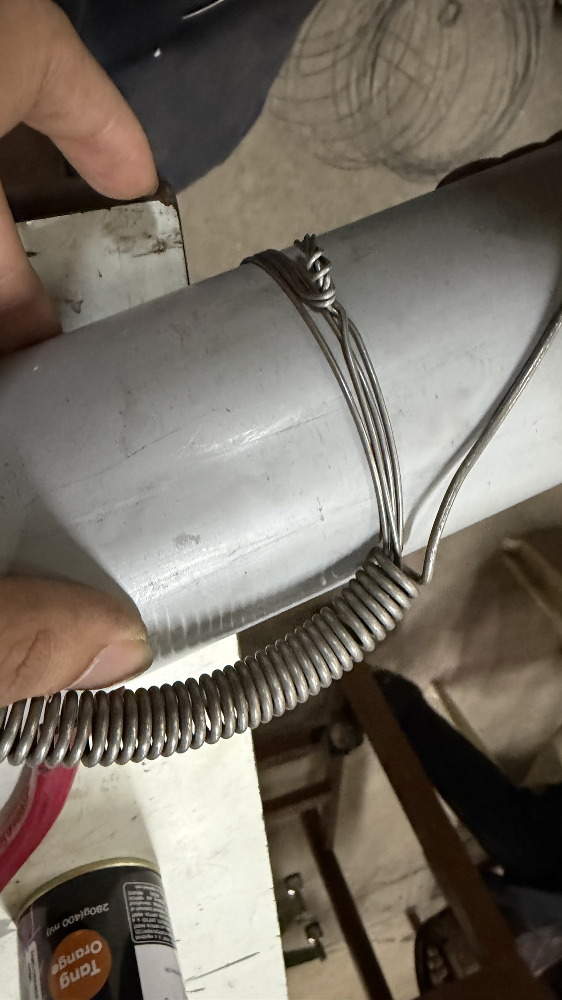<figcaption></figcaption></figure>

Make sure you let the loose end be as long as possible on both sides, since this is where the heating element will be connected to the circuit. They essentially serve as the terminals of the heating element!

Now, you'll need help for this as well - actually coiling the coil around the PVC. Again, make sure it is as tight as humanly possible, and while keeping this tightness - you must tie the other end of the coil with Kanthal of a lesser gauge :

<figure>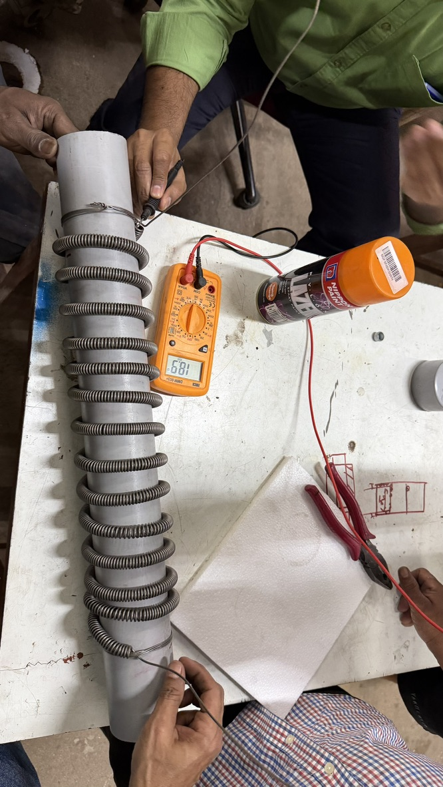<figcaption></figcaption></figure>

After you have toiled this much, enjoy the fruits of your labour by measuring the coils net resistance, since this will decide how much current will pass through and how hot it will theoretically get!

Thats it! The coiled coil is done!

#### 2.2 The PVC Mould

The PVC mould, at the end of the day, is a mould. The only purpose it serves is to shape the cement cast. However, there are some things you must take into consideration before pouring in the cement :&#x20;

1. Make holes to let the loose Kanthal ends out
2. Install the PVC pipe caps in such a way so that water can be drained from the cement

Number 1 is easy, just measure where you want your Kanthal to poke out and drill a hole there.

<figure>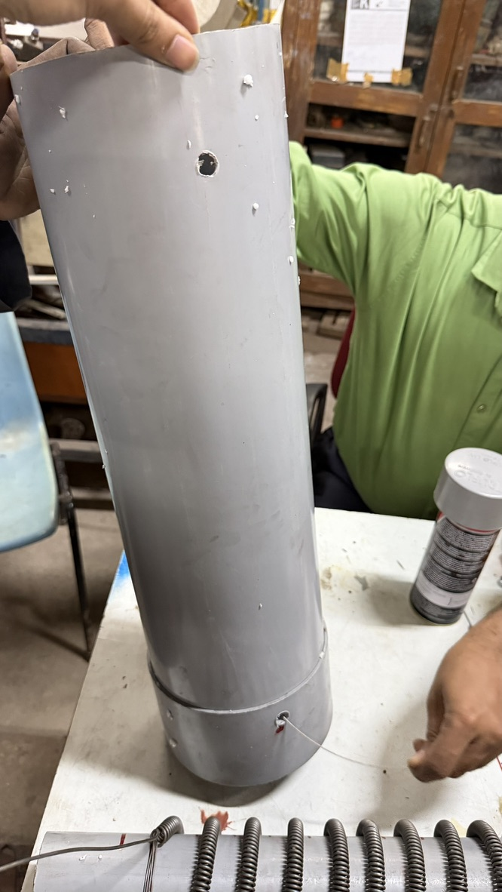<figcaption></figcaption></figure>

Number 2 is a bit tricky, and requires modifying with the PVC pipe caps a little. Drill a hole the diameter of the inner pipe (75 mm) in the outer PVC's cap. You will need a lathe for this :

<figure><figcaption></figcaption></figure>

Once that is done, just put the cap onto the outer PVC and cover the inner parts of the cap with thermocol like so :

<figure>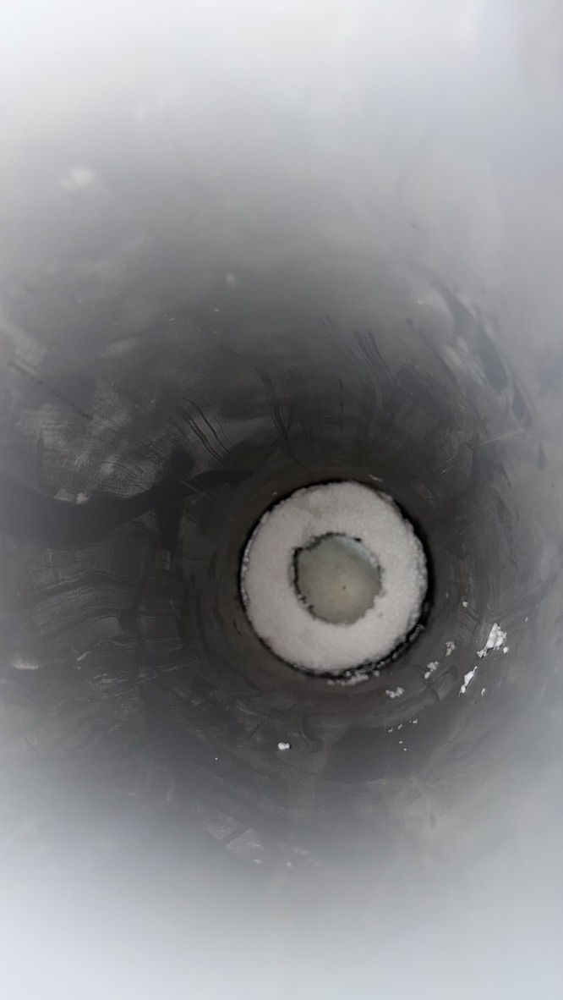<figcaption></figcaption></figure>

This leaves an essential gap between the PVC cap and the cement, so that they don't stick and the water can drain through it. Now, carefully lower the coiled coil on the inner PVC and fit it into the hole on the outer PVC cap. Make sure the coil maintains a uniform pitch throughout this procedure.

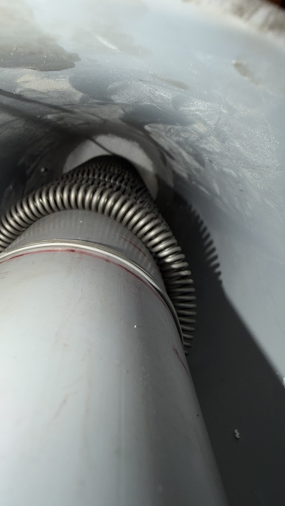&#x20;

Now that this is done, only install the inner PVC cap on one side, which is the side from which we will pour the cement. It should not be installed on the other side so that water can drain out.&#x20;

#### 2.3 The Cement Pour

This is the last and final step after which you will have a ready to use heating element.&#x20;

* Mix the cement with water in a 4:1 ratio (4 parts water 1 part cement)
* Pour it inside the mould
* Let the mould sit for 3-4 days
* Water it everyday (Pour water on it)

The mould:

<figure>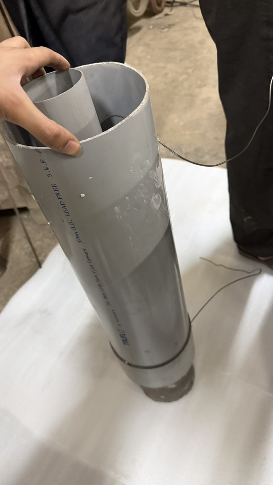<figcaption></figcaption></figure>

After pouring, it should be kept upright and secured:

<figure>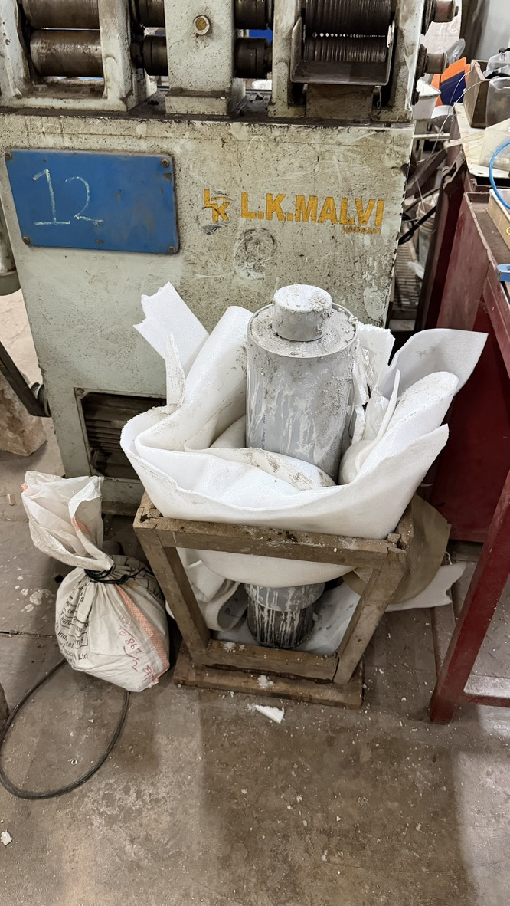<figcaption></figcaption></figure>

Some itty bitty things you need to worry about :&#x20;

* There should be no bubbles in the cement&#x20;
  * To remove all the bubbles, take a steel rod and "churn" the cement
  * MAKE SURE to not disturb or touch the coil while doing this
* The coil should not move because of the cement, to ensure this you need to coil the coil around the inner PVC as tightly as possible.

#### 2.4 Curing the Cement

Removing the PVC pipes utilizes quite a bit of firepower. Firstly, cut of the outer PVC using an angle grinder :&#x20;

<figure>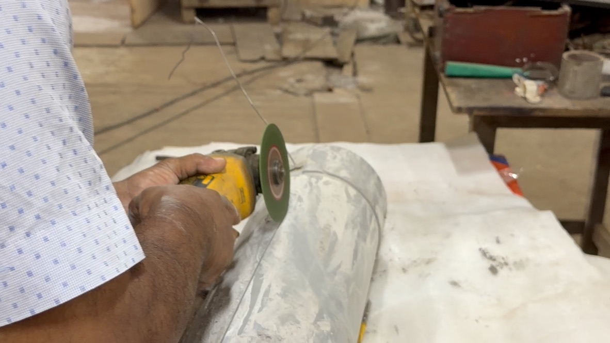<figcaption></figcaption></figure>

The uncured cement should look something like this, even after trying our hardest to remove all the bubbles, some were still there :&#x20;

<figure>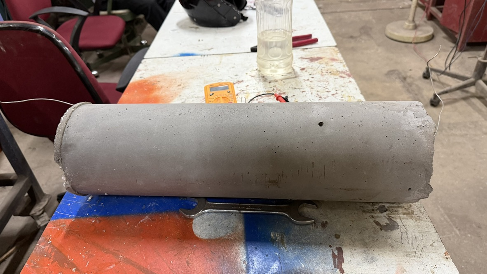<figcaption></figcaption></figure>

There is no peaceful way to remove the inner PVC. Use a oxygen blowtorch to melt the inner PVC off the cement :&#x20;

<figure>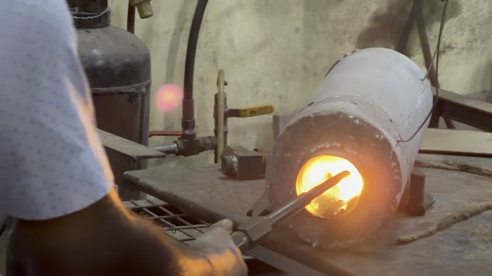<figcaption></figcaption></figure>

Then, to the extruding Kanthal Coil ends, twirl Kanthal of a lesser gauge around them to make them thicker and being able to take more current. (You can see this in the next picture)

After this is done, wire the cement to the main line **(DO THIS WITH EXTREME CAUTION, AND WITH THE HELP OF A PROFESSIONAL!!)**&#x20;

<figure>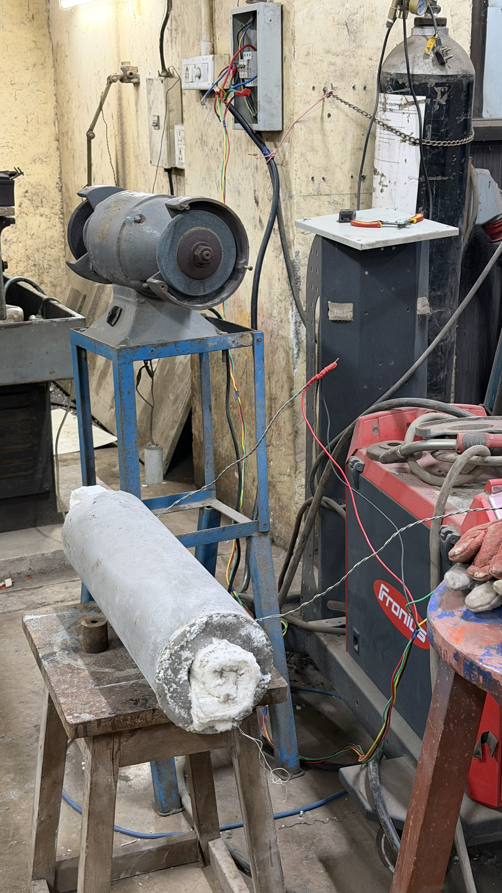<figcaption></figcaption></figure>

I will give brief directions on how to do this here, but I heavily advise you to do these with the help of an electrician or someone who has done these things before :&#x20;

* Identify Mains, Neutral, Ground pins
* Attach 2 thick gauge wires to Mains
* Attach these wires to one end and the other end to Neutral

We are not responsible if any injury or death occurs to you. Please do this carefully and with someone knowledgeable.&#x20;

After this has been done,&#x20;

### The Circuit

#### Component List

* Multispan UTC-4202G+ PID Controller
* Fotek SSR-40DA (40A)
* Bakelite Connector (30A)
* K-Type Minerally Insulated Thermocouple
* Digital AC Voltmeter
* Digital AC Ammeter
* Heating Switch(MCB 25A)
* Main Switch

Here are the datasheets for the Temperature Controller and SSR





<figure><figcaption></figcaption></figure>

Here is the pinout of the temperature controller,the connections we've made are:

1. Pin 1 - Live wire
2. Pin 2 - Neutral wire
3. Pin 6 - SSR Pin 4 (DC-)
4. Pin 7 - SSR Pin 3 (DC+)
5. Pin 8 - K-Type Thermocouple(yellow wire)
6. Pin 9 - K-Type Thermocouple(red wire)

We used K-Type Thermocouple where the positive wire was yellow and the negative wire was red.

Note: You can also make your own controller we just decided to use the one we already had in the lab.

Here's a colour coding chart depending on what type of thermocouple you use

<figure><figcaption></figcaption></figure>

Here is the SSR connection diagram

<figure><figcaption></figcaption></figure>

As mentioned above we've connected pin 3 of the ssr to pin 7 of the controller and pin 4 to pin 8

Note: I've attached the datasheet and connections for the fotek 40DA ssr, but we've used the sibass one but the functionality remains the same

Bakelite Connector: We've used it to interface all the connections we need safely. It is rated for 30A

<figure><figcaption></figcaption></figure>

This is what the overall circuit looks like:

<figure><figcaption></figcaption></figure>

## Safety

As students, we tend to disregard the matter of safety under the impression "kya hi ho jaayega?". However, the tube furnace, or as a matter of fact any project you pursue, should always be carried out following the appropriate safety protocols. This is a project, wherein ignoring safety protocols may result in heavy injury or the loss of life. We at HackerFab IITB always follow the due protocol, and encourage you to do so as well.

### Electrical Safety

The furnace runs on mains power and draws significant current (10-12 Amps). A simple mistake like touching the heating element can be fatal. Take significant precaution, I have listed a few golden rules:

#### 1. Always ground any metal enclosures

The furnace enclosure is made of MS (mild steel) and can carry any leaking current. The entire enclosure must be securely grounded. Always check whether all metal bodies are grounded with a multimeter (by checking continuity) before starting the furnace.

#### 2. Isolate Power

Put all the electronic components inside a metal box. This metal box should never be opened while the furnace is running. Do not touch any of the wiring, or the electronics inside the box while the furnace is plugged in. Always unplug the system before maintenance.

#### 3. Wire Gauges

Ensure you strictly follow the BOM for wiring. Use the 2.5 sqmm wire for the high-current AC lines and heating element connections to prevent wire melting and electrical fires.

### Thermal Safety

Operating at 1100°C means standard safety gear is not enough. You will get burnt even if you touch a thousand degree quartz boat with specialised gloves.

#### 1. Fire Hazard

Keep the furnace on a non-combustible surface (like a concrete table, thick ceramic tiles or a steel table). Ensure there are no flammable materials, chemicals, or papers within at least a 1-meter radius. Always keep a fire extinguisher nearby.

#### 2. Never leave unattended

Do not leave the furnace unattended while it is ramping up or holding at high temperatures.

#### 3. Cooling Time

The furnace will remain dangerously hot for hours after the power is turned off. Do not attempt to touch the outer enclosure, and never open the tube or remove the quartz boat until the internal temperature has dropped below 100°C.

#### 4. Quartz never looks hot

Quartz, even above a thousand degrees celsius, will always look transparent and never turn red. Let the quartz boat cool after removing it.

### Material Handling Hazards

Always check the MSDS of the material in question before doing anything with it. You could play with a harmless looking material, and it could turn out to be a carcinogen (ceramic wool)!

#### 1. Ceramic Wool

Ceramic wool fibers can cause severe respiratory irritation and long-term lung damage if inhaled. Always wear a high-quality N95 or P100 respirator mask, safety goggles, and gloves when cutting, packing, or handling the ceramic wool.

Here is the MSDS, I urge you to take a look at it:



#### 2. Quartz Glass

The quartz tube and boat are highly susceptible to thermal shock. Pulling the boat out too quickly while it is hot will cause it to shatter. Handle quartz with care to avoid cuts.

This is certainly not as bad as ceramic wool, but you should still check the MSDS out:



#### 3. First Burn-In

The first time you fire up the furnace, the Whytheat refractory cement and some components will off-gas moisture and potentially toxic fumes. The first run must be done in a highly ventilated area or under an exhaust hood. This point may feel unlikely, but trust me, the cement will fume out the first time after being cured.

Again, not as bad as the ceramic wool. Here is the MSDS:


